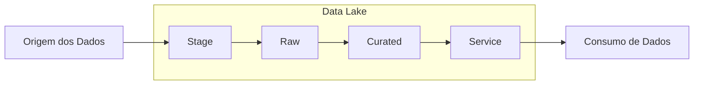
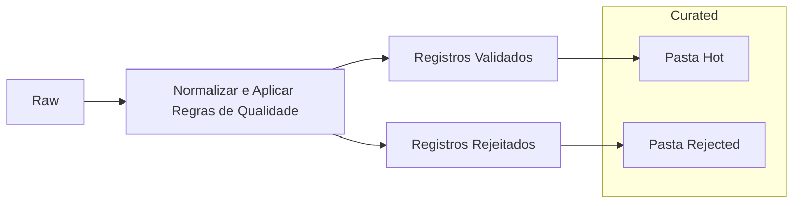

**Engenharia de Dados - HIAE: Teste para Seleção de Engenheiro de Dados**

**Requisitos do Projeto e Atividades**

Este teste tem como objetivo a aplicação de conhecimentos em engenharia de dados para ingestão, curadoria, processamento e consumo de dados em uma solução Big Data. A arquitetura simplificada do Data Lake foi usada como referência, e as atividades foram divididas em quatro etapas principais: Ingestão, Normalização, Processamento, e Uso dos Dados Transformados.

### **Atividade 1: Ingestão**

**Origem dos Dados**: [Repositório Data Sharing FAPESP](https://repositoriodatasharingfapesp.uspdigital.usp.br/handle/item/98)  
Pasta de arquivos, com dados anonimizados de pacientes que fizeram teste para COVID-19 a partir de 1/11/2019, compactada em formato zip. Contém 2 arquivos em formato CSV e 1 arquivo em formato XLXS:
1. Planilha com dados anonimizados sobre pacientes que fizeram teste para o COVID-19 (sorologia ou PCR) no Hospital Israelita Albert Einstein, incluindo: identificador anonimizado do paciente, gênero, país, estado, município e região de residência.
2. Resultados de exames laboratoriais, contendo, dentre outros, o identificador anonimizado do paciente.
3. Dicionário de dados: planilha em que cada aba descreve todos os campos das planilhas de Pacientes e de Exames. Pacientes e seus Exames são interligáveis pelo identificador anonimizado do paciente.

**Entrada**: arquivo zip da origem de dados descrita

**Atividades**:
- Criar e organizar as camadas do data lake (stage, raw, curated e service) no sistema de arquivos do seu Sistema Operacional.
  - Levar em consideração a separação por origem e tabela/arquivo (stage, raw e curated), e também o domínio específico (service).
- Extração e movimentação de dados: colocar os arquivos CSV na camada stage.
  - Levar em consideração a data de movimentação.
- Usando Spark, faça a ingestão na camada raw a partir dos dados que estão na camada stage.
  - Adicionar um campo `DT_CARGA` de tipo DATE para a data de ingestão.
  - Os dados na camada Raw devem estar em formato parquet e compressão snappy.
  - A codificação dos dados deve ser UTF-8.
  - Criar uma rotina para mover os arquivos CSVs, após a ingestão, para uma pasta de histórico (que inclui a data de movimentação) na camada stage.

**Resultado esperado**:
- Na camada Stage: uma pasta de histórico (com data de movimentação) que contém os arquivos originais ingeridos na camada Raw.
- Na camada Raw: arquivos por base, tabela/arquivo em formato parquet, compressão snappy e codificação UTF-8.

### Atividade 2: Normalização e aplicação de regras de qualidade

**Entrada**: arquivos parquet de exames e pacientes na camada Raw

**Atividades**:
- Usando Spark, para cada base/tabela/arquivo normalizar e aplicar regras de qualidade conforme a especificação da Tabela 1.
- Colocar numa pasta `hot` na camada Curated, os registros normalizados e que passaram as regras de qualidade.
- Colocar numa pasta `rejected` na camada Curated, os registros que não passaram as regras de qualidade.

**Tabela 1: Regras de normalização e qualidade**

| Tabela/Arquivo | Normalização | Regras de Qualidade |
| -------------- | ------------ | ------------------- |
| Pacientes      | - No campo `CD_MUNICIPIO`, converter valores `MMMM` para `HIDEN`. - No campo `CD_CEPREDUZIDO`, converter valores `CCCC` para `HIDEN`. | Campos obrigatórios, não vazios e não NULL: `ID_PACIENTE`, `AA_NASCIMENTO`, `CD_PAIS`, `CD_MUNICIPIO`. |
| Exames         | - Campo `DE_ANALITO` deve ser de tipo DATE. - No campo `DE_RESULTADO`, converter valores para minúsculo e garantir que cada palavra esteja separada por apenas um espaço (usar UDF para este caso). | Campos obrigatórios, não vazios e não NULL: `ID_PACIENTE`, `DT_COLETA`, `DE_ORIGEM`, `DE_EXAME`, `DE_RESULTADO`. |

**Resultado esperado**:
- Arquivos parquet com compressão snappy na camada Curated por base e tabela/arquivo.
- Se os registros passaram as regras de qualidade e não deram erro devem estar na pasta `hot`, caso contrário na pasta `rejected`.

**Diagrama de Normalização e qualidade**

### Atividade 3: Transformação e processamento

**Entrada**: arquivos parquet de exames e pacientes na camada Curated

**Atividades**:
- Usando Spark, cruzar os dados de exames e pacientes, das respectivas pasta `hot` na camada Curated, para gerar um novo conjunto de dados e colocar os resultados numa pasta `exames_por_pacientes` na camada Service.
  - O novo conjunto de dados deve ser gerado cruzando pelo campo `ID_PACIENTE`. A seguir mais detalhes das colunas:
    - Dos pacientes:
      - Manter as colunas exceto `AA_NASCIMENTO` e `DT_CARGA`.
      - Adicionar um campo `VL_IDADE` calculado a partir do campo `AA_NASCIMENTO`.
    - Dos exames:
      - Manter todas as colunas exceto `DT_CARGA`.
    - Particionar pelas colunas `CD_PAIS` e `CD_UF`.
- Gerar mais um novo conjunto de dados `exames_por_paciente_sp` na camada Service, gerado a partir de `exames_pacientes` para o estado de São Paulo (`CD_UF = 'SP'`).

**Resultado esperado**:
- Arquivos parquet numa pasta `exames_por_pacientes` na camada Service e particionado pelas colunas `CD_PAIS` e `CD_UF`.
- Arquivos parquet numa pasta `exames_por_pacientes_sp` na camada Service.

### Atividade 4: Uso dos dados transformados

**Entrada**: arquivos parquet da pasta `exames_por_pacientes_sp` na camada Service

**Atividades**:
- Usando Pandas e bibliotecas de visualização em Python:
  - Obter um novo DataFrame com registros que tenham resultados de tipo qualitativo: filtrar pelo campo `DE_RESULTADO` os valores que não sejam numéricos.
  - A partir do DataFrame anterior, visualizar um histograma mostrando a quantidade (contagem) de registros por `DE_ANALITO` ordenados descendentemente pela quantidade.

**Resultado esperado**:
- Histograma mostrando quantidade de registros por `DE_ANALITO` a partir dos dados na pasta `exames_por_pacientes_sp` na camada Service.
