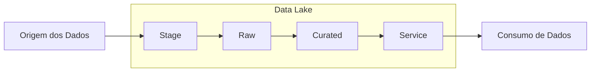

# Projeto Data Lake - HIAE

## Visão Geral
Este projeto simula a ingestão, curadoria, processamento e consumo de dados anonimizados de testes de COVID-19 do Hospital Israelita Albert Einstein. Ele foi projetado seguindo uma arquitetura simplificada de Data Lake como parte de um teste de seleção de engenharia de dados.

## Arquitetura
O projeto é estruturado em torno de um Data Lake com quatro camadas:

- **Stage**: Armazena os arquivos brutos antes da ingestão.
- **Raw**: Armazena os arquivos ingeridos no formato Parquet, comprimidos com Snappy.
- **Curated**: Contém os dados limpos e normalizados após a aplicação de regras de qualidade.
- **Service**: Disponibiliza os dados para consumo final e análise.



## Funcionalidades
- Ingestão de arquivos CSV brutos para o formato Parquet.
- Normalização e verificações de qualidade dos dados com Spark.
- Transformação e agregação de dados.
- Análise de dados e visualização utilizando Pandas.

## Instalação

### Pré-requisitos
Certifique-se de ter as seguintes ferramentas instaladas:

- Python 3.8+
- Apache Spark 3.0+
- Java JDK 8 ou superior
- Docker (para executar o Spark em um ambiente isolado)

### Configurando o Ambiente

**Clone o Repositório:**

```bash
git clone https://github.com/alfprado/data_lake_hiae
cd data_lake_hiae
```

**Instale as Dependências do Python:** Certifique-se de ter o `pip` instalado e depois instale os pacotes necessários do Python:

```bash
pip install -r requirements.txt
```

**Configure as Variáveis de Ambiente:** Crie um arquivo `.env` no diretório raiz para armazenar os caminhos necessários:

```bash
ZIP_FILE_PATH=data/source/EINSTEINAgosto.zip
STAGE_PATH=data/stage
RAW_PATH=data/raw
HISTORY_PATH=data/stage/history
CURATED_PATH=data/curated
SERVICE_PATH=data/service
SPARK_MASTER=local[*]
```

**Execute o Spark no Docker:** Caso precise de um cluster Spark, você pode inicializá-lo usando o Docker:

```bash
docker-compose build
```

Para executar o pipeline:
```bash
docker-compose up data_pipeline
```

Para executar a análise:
```bash
docker-compose up data_analysis
```

## Executando os Testes
O projeto utiliza o pytest para testes automatizados. Para executar todos os testes:

```bash
pytest -v
```

Certifique-se de que todas as variáveis de ambiente estão definidas antes de executar os testes. 

## Estrutura do Projeto

```bash
data_lake_hiae/
│
├── .github/                            # Configurações específicas do Github
│   └── workflows/                      # Arquivos de workflow (ex. CI/CD)
│
├── doc/                                # Documentação do projeto
│   └── Prova Engenheiro de Dados.pdf   # Instruções e detalhes do teste
│
├── scripts/                            # Código-fonte principal do projeto
│   ├── ingestion.py                    # Lógica para ingestão de dados
│   ├── normalization.py                # Normalização e regras de qualidade dos dados
│   ├── transformation.py               # Transformação de dados
│   ├── analysis.py                     # Análise de dados usando Pandas
│
├── tests/                              # Testes de unidade e integração
│   ├── test_ingestion.py               # Testes para o módulo de ingestão
│   ├── test_normalization.py           # Testes para o módulo de normalização
│   ├── test_transformation.py          # Testes para o módulo de transformação
│   └── conftest.py                     # Configuração dos testes
│
├── data/                               # Diretório para armazenamento de arquivos de dados
│   ├── source/                         # Dados originais e compactados (ex.: arquivos zip, tar)
│   ├── stage/                          # Dados intermediários, extraídos do estado bruto, mas ainda não totalmente processados
│   ├── raw/                            # Dados brutos no formato original antes de qualquer transformação
│   ├── curated/                        # Dados limpos e preparados para consumo (transformados, validados)
│   └── service/                        # Dados prontos para serem consumidos por serviços (ex.: APIs, sistemas externos)
│
├── output/                             # Diretório para armazenamento de resultados e análises geradas
│   └── histogram.png                   # Arquivo de imagem do histograma gerado nas análises
│
├── Dockerfile                          # Configuração para construção da imagem Docker
├── docker-compose.yml                  # Configuração para orquestração de containers com Docker Compose
├── .flake8                             # Configurações para o linter Flake8
├── .gitignore                          # Arquivos e diretórios a serem ignorados pelo Git
├── .dockerignore                       # Arquivos a serem ignorados na construção do Docker
├── .env.example                        # Exemplo de variáveis de ambiente para configuração local
├── .pre-commit-config.yaml             # Configuração de hooks para pré-commit (linter, formatação)
├── requirements.txt                    # Dependências do Python para produção
├── requirements-dev.txt                # Dependências do Python para desenvolvimento
├── pyproject.toml                      # Configurações gerais do projeto (ex. build system, formatação)
└── README.md                           # Documentação principal do projeto


```
## Próximos passos
- Melhorias nos testes
- Adicionar CD

## Instruções de projeto
[Prova Engenheiro de Dados.pdf](<doc/Prova Engenheiro de Dados.pdf>)

## Licença
Este projeto está licenciado sob a Licença MIT.